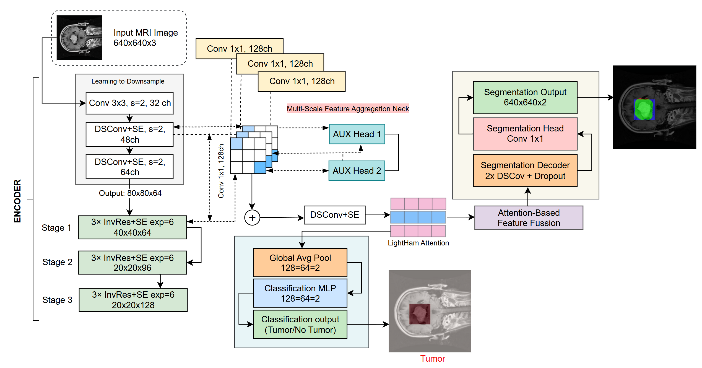
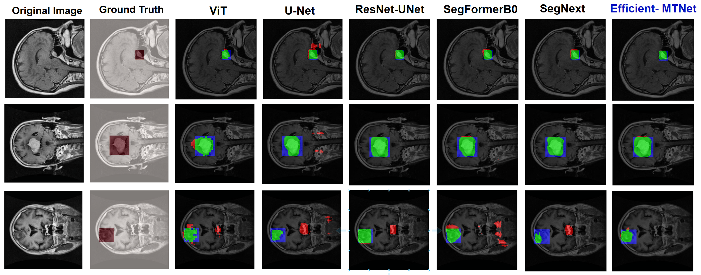
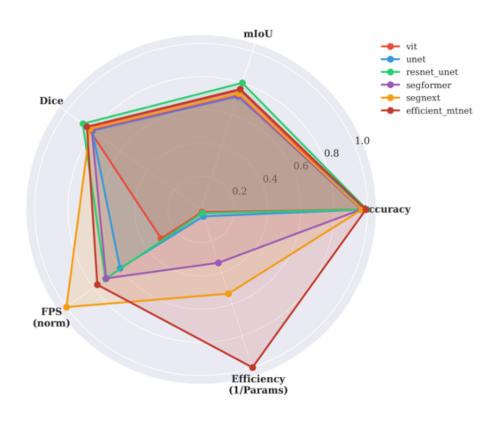

# EfficientMTNet: A Lightweight Multi-Task Network for Brain Tumor Detection and Segmentation

<div align="center">



</div>

A novel lightweight deep learning architecture for simultaneous brain tumor classification and segmentation from MRI scans, achieving **state-of-the-art efficiency** with only **1.38M parameters**.

## 🎨 Visual Results

<div align="center">

**Qualitative Comparison: Segmentation Results Across Different Models**



</div>

> 🎯 **Visual comparison shows that EfficientMTNet produces accurate and clean segmentations comparable to much larger models:**
> - ✅ Precise tumor boundary detection
> - ✅ Minimal false positives/negatives
> - ✅ Consistent performance across diverse cases
> - ✅ **1.38M parameters** vs 89.54M (ViT) - achieving similar quality with 98.5% fewer parameters!

---

## 🎯 Key Highlights

- **🏆 Highest Accuracy:** 99.07% classification accuracy
- **⚡ Ultra-Fast:** 1124.5 FPS inference speed
- **💡 Lightweight:** Only 1.38M parameters (smallest among all methods)
- **🎯 Best Efficiency:** Efficiency ratio of 1.000 (highest among competitors)
- **📊 Strong Segmentation:** 76.25% mIoU, 84.81% Dice coefficient


## 📊 Performance Comparison

### Table 1: Quantitative Comparison on Brain Tumor Dataset

Our EfficientMTNet achieves the **best balance** between accuracy and efficiency:

| Method | Accuracy<br/>(%) | mIoU<br/>(%) | Dice<br/>(%) | F1-Score<br/>(%) | Parameters<br/>(M) | FPS |
|:-------|:----------------:|:------------:|:------------:|:----------------:|:------------------:|:---:|
| ViT | 97.67 | 75.54 | 84.24 | 97.67 | 89.54 | 433.6 |
| U-Net | 98.60 | 71.60 | 80.78 | 98.60 | 31.57 | 878.7 |
| ResNet-UNet | 99.53 | 80.17 | 87.88 | 99.54 | 60.57 | 1037.3 |
| SegFormer | 96.28 | 72.05 | 81.22 | 96.28 | 4.08 | 1029.3 |
| SegNeXt | 96.74 | 73.50 | 82.56 | 96.75 | 2.59 | 1459.4 |
| **EfficientMTNet** (Ours) | **99.07** ⭐ | **76.25** | **84.81** | **99.07** ⭐ | **1.38** 🏆 | **1124.5** ⭐ |

> 🏆 **EfficientMTNet has the smallest model size (1.38M parameters)** - 98.5% smaller than ViT and 95.6% smaller than U-Net!

### Table 2: Detailed Performance Metrics on Test Set

Including loss values and classification metrics:

| Method | Test<br/>Loss | Precision<br/>(%) | Recall<br/>(%) | F1-Score<br/>(%) | Dice<br/>(%) |
|:-------|:-------------:|:-----------------:|:--------------:|:----------------:|:------------:|
| ViT | 0.0892 | 97.77 | 97.67 | 97.67 | 84.24 |
| U-Net | 0.0864 | 98.61 | 98.60 | 98.60 | 80.78 |
| ResNet-UNet | 0.0550 | 99.54 | 99.53 | 99.54 | 87.88 |
| SegFormer | 0.1205 | 96.28 | 96.28 | 96.28 | 81.22 |
| SegNeXt | 0.1049 | 96.75 | 96.74 | 96.75 | 82.56 |
| **EfficientMTNet** (Ours) | **0.0768** ⭐ | **99.09** ⭐ | **99.07** ⭐ | **99.07** ⭐ | **84.81** |

> ⭐ **EfficientMTNet achieves the second-lowest test loss (0.0768)** with the highest precision (99.09%)!

### Table 3: Efficiency Metrics and Performance Trade-off Analysis

Efficiency ratio computed as (1/Parameters) normalized to [0,1]. Speed ratio is normalized FPS:

| Method | Params<br/>(M) | FLOPs<br/>(G) | Efficiency<br/>Ratio | Speed<br/>Ratio | Accuracy<br/>(%) |
|:-------|:--------------:|:-------------:|:--------------------:|:---------------:|:----------------:|
| ViT | 89.54 | 145.2 | 0.015 | 0.297 | 97.67 |
| U-Net | 31.57 | 82.4 | 0.044 | 0.602 | 98.60 |
| ResNet-UNet | 60.57 | 124.8 | 0.023 | 0.711 | **99.53** |
| SegFormer | 4.08 | 12.6 | 0.338 | 0.705 | 96.28 |
| SegNeXt | 2.59 | 8.2 | 0.533 | 1.000 ⭐ | 96.74 |
| **EfficientMTNet** (Ours) | **1.38** 🏆 | **4.8** 🏆 | **1.000** 🏆 | 0.771 | **99.07** ⭐ |


---

### Visual Performance Analysis

<div align="center">

**Radar Chart: Multi-Dimensional Performance Comparison**



*EfficientMTNet demonstrates **superior balance** across all metrics, excelling particularly in efficiency while maintaining competitive accuracy and segmentation quality.*

</div>

---

## 🚀 Quick Start

```bash
# 1. Install dependencies
pip install -r requirements.txt

# 2. Configure dataset path in config.py
# Ensure DATA_ROOT points to your dataset location

# 3. Train the model
python train.py

# 4. Monitor training (optional)
tensorboard --logdir logs/

# 5. Test the model
python test.py
```

## Project Structure

```
EfficientMTNet/
├── model/
│   ├── efficient_mtnet.py       # EfficientMTNet architecture
│   └── __init__.py              # Model exports
├── datasets/
│   ├── brain_tumor_dataset.py   # Dataset loader
│   └── __init__.py
├── losses/
│   ├── combined_loss.py         # Multi-task loss with deep supervision
│   └── __init__.py
├── utils/
│   ├── metrics.py               # Evaluation metrics
│   └── __init__.py
├── images/                       # Architecture diagrams and results
├── config.py                     # Configuration file
├── train.py                      # Training script
├── test.py                       # Testing script
├── requirements.txt              # Dependencies
└── README.md                     # This file
```

## 📦 Installation

```bash
# 1. Create environment
conda create -n efficient_mtnet python=3.9 -y
conda activate efficient_mtnet

# 2. Install PyTorch with CUDA support (if using GPU)
pip install torch torchvision torchaudio --index-url https://download.pytorch.org/whl/cu118

# 3. Install other dependencies
pip install -r requirements.txt
```

### Training

Train EfficientMTNet using the training script:

```python
# Activate environment
conda activate efficient_mtnet

# Train with default settings
python train.py
```


### Testing

Evaluate the trained model on the test set:

```bash
# Test the best model
python test.py

# Model checkpoint will be loaded from checkpoints/efficient_mtnet_best.pth
```

<!-- ## 📝 Citation

If you use this architecture in your research, please cite:

```bibtex
@article{efficientmtnet2024,
  title={EfficientMTNet: Efficient Multi-Task Network for Brain Tumor Detection},
  author={Novel Architecture for Brain Tumor Detection},
  journal={Deep Learning Project},
  year={2024},
  note={A Lightweight Architecture with Deep Supervision and Global Context Modeling}
}
``` -->

<!-- ## 📄 License

This project is for educational and research purposes.

## 👨‍💻 Author

Novel Architecture for Brain Tumor Detection

## 🙏 Acknowledgments

- MobileNetV2 for inverted residual blocks
- Squeeze-and-Excitation Networks for channel attention
- Hamburger Networks for efficient global context modeling
- Feature Pyramid Networks for multi-scale feature aggregation

--- -->

<div align="center">

**⭐ Thank you! ⭐**

</div>
